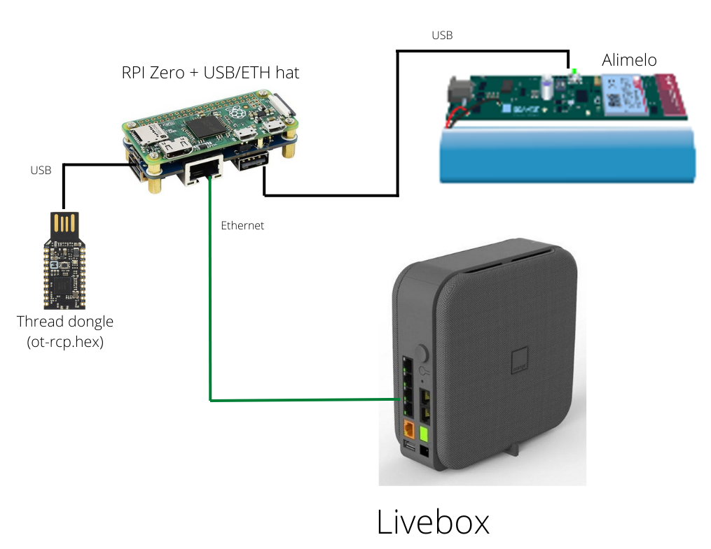

## RPI Box



# OS installation

You can use the [Raspberry Pi Imager](https://www.raspberrypi.com/software/) to flash the last 64-bit Bullseye ligth version (no desktop)

# Initial setup

Use raspi-config to configure the RPI

```bash
sudo raspi-config
```

- Configure the camera interface
- Configure the SSH interface
- Connect to your Wi-Fi network (you must have an internet connection)

## Update OS

```bash
sudo apt update
sudo apt upgrade
```

## Install and configure git

```bash
sudo apt install git
git config --global user.name "Nicolas44Hernandez"
git config --global user.email n44hernandezp@gmail.com
```
## Clone rpi_box repository

```bash
mkdir workspace
git clone https://github.com/Nicolas44Hernandez/GreenHomeLan_RpiBox.git
```

## Install the dependencies
```bash
cd GreenHomeLan_RpiBox
pip install -r server_box/requirements.txt
```

To add the dependencies to PATH, edit the `bashrc` file

```bash
nano ~/.bashrc
```
add line
```
export PATH="$PATH:/home/pi/.local/bin"
```

## **Open Thread setup**

The complete installation and network setup procedure can be found [here](https://espace.agir.orange.com/display/HOMEINAI/How+to+set+up+OpenThread+Network)

First, you need to retrieve Git Project:

```bash
git clone https://github.com/openthread/ot-br-posix.git --depth 1
```

Then you need to execute a scripts to bootstrap the Thread Border Router (not with sudo):

```bash
cd ot-br-posix
./script/bootstrap
```

You will need to also retrieve infrastructure network interface (e.g. Wi-Fi/Ethernet) to specified it in a script to start Thread Border Router:

Use this command to determine correct interface

```bash
ip addr
```

Execute script

```bash
INFRA_IF_NAME=<interface> ./script/setup
#Examples Below
#INFRA_IF_NAME=eth0 ./script/setup
#INFRA_IF_NAME=wlan0 ./script/setup
```

Note: If your Raspberry Pi is connected by an Ethernet cable, specify the Ethernet interface name (e.g. eth0)

You can verify the installation  by verifying otbr-agent status:

```bash
sudo service otbr-agent status
```

Note: otbr-agent service is not active, because it requires an RCP chip to run.

Connect nRF52840-dongle to your Raspberry Pi/NUC (the one flashed with ot-rcp.hex), restart otbr-agent service and recheck status to observe everything is now working fine:

```bash
sudo service otbr-agent restart
sudo service otbr-agent status
```

## **MQTT Broker setup**

This project uses a mosquitto MQTT broker.

**Step-1**
Update the RPI OS

```bash
sudo apt-get update
sudo apt-get upgrade
sudo apt-get dist-upgrade
```

**Step-2**
Install mosquitto and then the mosquitto-clients packages.

```bash
sudo apt-get install mosquitto -y
sudo apt-get install mosquitto-clients -y
```

**Step-3**
Configure the MQTT broker. The Mosquitto broker’s configuration file is located at */etc/mosquitto/mosquitto.conf*

```bash
sudo nano /etc/mosquitto/mosquitto.conf
```

Replace the line *include_dir /etc/mosquitto/conf.d* by :

```
allow_anonymous true
listener 1883
```

A reboot is necessary to take into account the modifications

```bash
sudo reboot now
```

**Step-4**
Test de MQTT broker by using the *mosquito_sub* and *mosquito_pub* commands (run commands in separated terminals)

```bash
mosquitto_sub -d -u username -t test
```

```bash
mosquitto_pub -d -u username -t test -m "Hello, World!"
```

**To empty MQTT Mosquito Broker**

```bash
sudo systemctl stop mosquitto.service
sudo rm /var/lib/mosquitto/mosquitto.db
sudo systemctl start mosquitto.service
```

## Disable Bluethoot and Wifi interfaces

```bash
sudo nano /boot/config.txt
```

Find the section *[all]* and add the following lines

```bash
dtoverlay=disable-wifi
dtoverlay=disable-bt
```

# Run the application

## Environment variables

To launch the application you must define the environment variables:

```bash
export FLASK_APP="server_box/server/app:create_app()"
export FLASK_ENV=development
```

## Create logfiles

Log files defined in configuration file located in *server_box/server/config/logging-config.yml* must be created before launching the application

```bash
mkdir logs
mkdir logs/manager
mkdir logs/interface
mkdir logs/orchestrator
touch logs/app.log logs/api-rest.log
touch logs/manager/mqtt.log logs/manager/camera.log logs/manager/electrical_panel.log logs/manager/thread.log logs/manager/wifi_bands.log logs/manager/wifi_5GHz_on_off.log logs/manager/alimelo.log
touch logs/interface/mqtt.log logs/interface/live_objects.log logs/interface/thread.log logs/interface/telnet.log logs/interface/alimelo.log
touch logs/orchestrator/orchestrator.log logs/orchestrator/orchestrator_notification.log logs/orchestrator/orchestrator_live_objects.log logs/orchestrator/orchestrator_polling.log logs/orchestrator/orchestrator_requests.log logs/orchestrator/orchestrator_use_situations.log
```

Pour lancer l'application flask, depuis Server_Box

```bash
flask run
```

## Set the rpi-box application as a service

Copy the service file

```bash
sudo cp server_box/service/rpi-box.service /etc/systemd/system/
```

Register service

```bash
sudo systemctl daemon-reload
sudo systemctl enable rpi-box
sudo systemctl restart rpi-box
```

## TODO
- [ ] Relays command management
